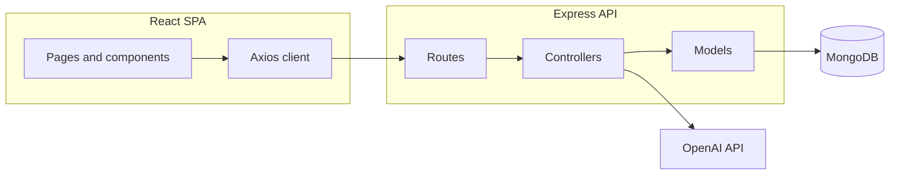

# PromptCraft AI — Architecture

## Overview

PromptCraft AI is a **MERN** application: a **Vite + React** single-page app talks to an **Express** API backed by **MongoDB**. Authentication uses **JWT** bearer tokens stored client-side (see `frontend/src/utils/storage.js`) and attached by the Axios client (`frontend/src/services/api/client.js`).

## Frontend

- **Routing**: `react-router-dom` with lazy-loaded pages (`frontend/src/routes/AppRouter.jsx`) and route-level transitions.
- **State**: React Context for auth and toasts; local component state for feature-heavy views (editor, preview, modals).
- **API layer**: Typed-ish service modules under `frontend/src/services/` calling `/api/*` endpoints.
- **Accessibility & UX**: `BaseAccessibleModal`, `useModalFocusTrap`, `ReducedMotionProvider`, `AppErrorBoundary`, `NetworkStatusBanner`, and `SEOHeadManager` (react-helmet-async) centralize cross-cutting UI concerns.

## Backend

- **Entry**: `backend/server.js` loads env, validates configuration, connects MongoDB, then listens.
- **HTTP**: `backend/src/app.js` wires security middleware (Helmet, CORS, rate limiting), JSON body parsing, and `/api` routes.
- **Domain**: Controllers + Mongoose models under `backend/src/controllers` and `backend/src/models`.
- **Errors**: `errorMiddleware.js` normalizes Mongoose errors, avoids leaking internals in production, and uses `safeErrorMessage.js` for client-facing messages.

## Data flow (simplified)

## Extension points

- **Heavy AI jobs**: Move long-running generation to a queue worker while keeping the same REST contract.
- **Real deployments**: Replace the mock deployment service with provider SDKs (Vercel, Netlify, etc.) behind feature flags.
- **Testing**: Add Jest/Vitest for utilities and Supertest for API contracts.
